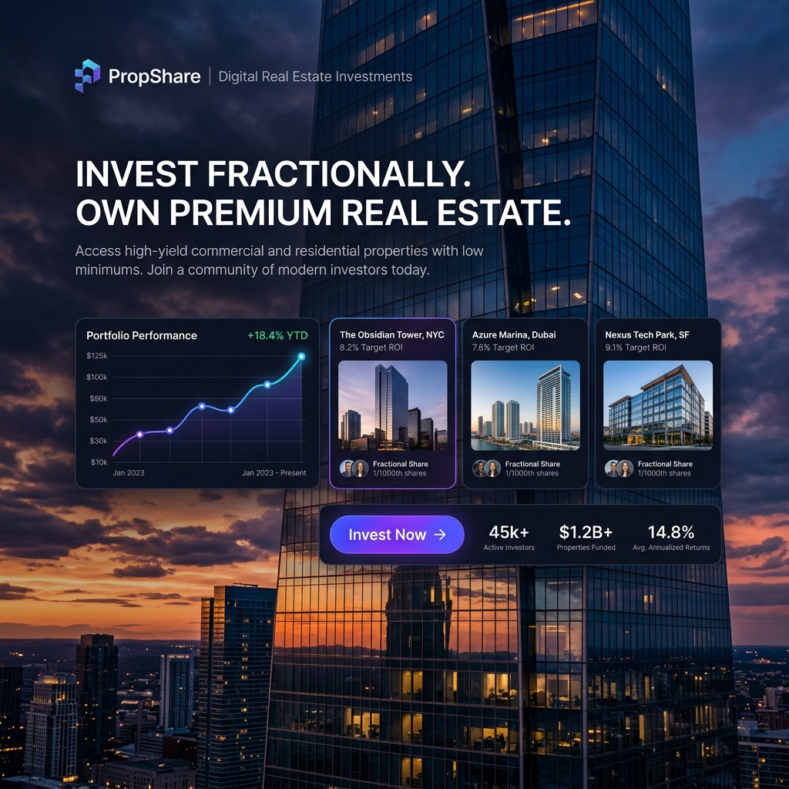

<div align="center">
  

  <br />

  # PropShare
  **Institutional-Grade Fractional Real Estate Platform**

  <br />

  **[Live Demo](https://propsphere.vercel.app)** &nbsp; • &nbsp; **[API Reference](https://prop-share.onrender.com)**

  <br />
</div>

---

### Description

PropShare is a high-performance investment ecosystem built to democratize access to premium real estate. By leveraging fractional ownership models, it allows users to invest in high-value commercial and residential assets with minimal capital, providing a transparent, liquid, and secure digital investment experience.

### Technologies

Developed with a modern, industry-standard stack for scalability and performance:

- **Frontend** — Next.js 15, React 19, TypeScript
- **Styling** — Tailwind CSS, CSS Variables
- **Animations** — GSAP, Framer Motion
- **Backend Infrastructure** — Node.js, Express, Prisma ORM
- **Database** — PostgreSQL
- **Media Management** — Cloudinary

### Project Architecture

The codebase follows a modular, scalable structure optimized for Next.js 15:

```text
src/
├── app/             # Application routes and server components
├── components/      # Reusable UI modules & layouts
├── contexts/        # Global state and authentication logic
├── hooks/           # Custom React hooks for business logic
├── lib/             # API clients and utility functions
├── types/           # Global TypeScript definitions
└── assets/          # Static media and graphic resources
```

### Installation

```bash
# Clone & Setup
git clone https://github.com/arabyhossainabid/propshare.git
cd propshare
pnpm install

# Environment Configuration
# Edit .env.local with your service keys

# Development Mode
pnpm run dev
```

---

<div align="center">
  
  <br />
  <sub>Designed and Developed by <b>Araby Hossain Abid</b></sub>
</div>
